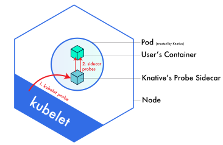

# Probing Demo

Knative Demo for KEP-20200921: Subsecond Probe Timeouts (TODO - link)

## Problem

Knative is a serverless platform built on top of Kubernetes. These workloads scale to zero and come back up on demand to serve an HTTP request. A cold start occurs when a request arrives but the workload is not running. Thus we need to queue the request and wait for the workload to scale up. A factor in the queue time is the length it takes the target Pod to report `Ready=True`. Because requests are buffered until the pod is ready this affects the experience of a user visiting a website or the SLA/SLOs of an API etc.

Probes are used to determine Pod readiness and they currently have a lower-bound period of one second. As the KEP mentions:
> Probe timeouts are limited to seconds and that does NOT work well for clients looking for finer and coarser grained timeouts.

The Knative community would benefit from this KEP in order to reduce our cold start times.

## Knative workaround

Knative currently works around this problem by delagating probing to a sidecar. The user's readinessProbe is rewritten to point to the sidecar. When the kubelet performs a probe the sidecar will loop and probe the user container at a more aggressively (~20ms) interval. This occurs until a timeout occurs or the user container becomes ready. Using a sidecar allows us to 

## Demo

This repository demonstrates the aforementioned approach without the need to install Knative

### Usage

1. Install [Kubernetes in Docker (KinD)](https://kind.sigs.k8s.io/)
2. Run `./test.sh`
